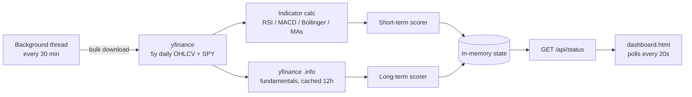

# 📈 Dual-Horizon US Stock Analyzer

A self-hosted dashboard that scores ~130 liquid US stocks (and ETFs) on **two
separate time horizons** — short-term (1–3 weeks, technical/quant) and
long-term (5 years, fundamentals/valuation) — and serves the results through
a live, auto-refreshing web dashboard.

It is an **analysis tool, not a trading bot.** It does not place trades, hold
positions, or touch any money, real or paper. It pulls market data, scores
it against a transparent rule set, and shows you the *reasoning* behind every
call.


---

## Why two horizons?

A stock can look great for a 3-week swing trade and bad for a 5-year hold
(or vice versa). Most screeners collapse this into one score. This tool
keeps them separate and scores each stock twice, side by side, using a
different factor model for each:

| | Short-term (1–3 wk) | Long-term (5 yr) |
|---|---|---|
| **Driven by** | Technicals + quant | Fundamentals + valuation |
| **Inputs** | RSI, MACD, Bollinger %b, moving averages, momentum, relative strength vs S&P, volatility | Revenue/earnings growth, margins, ROE/ROA, debt, free cash flow, P/E, PEG, analyst targets |
| **ETFs** | Scored normally (price-based) | Scored on trend only — fundamentals don't apply to a fund |

---

## How scoring works

Every factor produces a sub-score in `[-1, +1]`, gets multiplied by a fixed
weight, and the weighted sum becomes the stock's net score for that horizon.

**Short-term weights**

| Factor | Weight |
|---|---|
| Trend (MA20/50/200) | 25% |
| Momentum (RSI + MACD) | 30% |
| Mean reversion (Bollinger %b) | 10% |
| Volume confirmation | 10% |
| Relative strength vs S&P (15d) | 15% |
| Quant / volatility risk | 10% |

**Long-term weights**

| Factor | Weight |
|---|---|
| Growth (revenue + earnings) | 20% |
| Profitability (margins, ROE, ROA) | 15% |
| Financial health (FCF yield, debt, liquidity) | 15% |
| Valuation (P/E, PEG vs sector norms) | 20% |
| Sentiment (analyst targets/rating) | 10% |
| Long-run trend (MA50/MA200, 1y momentum & rel. strength) | 20% |

**Net score → verdict**

```
score ≥ +0.45   → STRONG BUY
score ≥ +0.18   → BUY
score ≤ −0.45   → STRONG SELL
score ≤ −0.18   → SELL
else            → HOLD
```

**Conviction is *not* a probability.** It measures how strongly the factors
agree with each other, not how likely the call is to be correct. It's
deliberately floored at 50% and capped at 80%, and tiered as Low / Moderate
/ High in the UI. This distinction is shown directly in the dashboard
disclaimer so it's never mistaken for a confidence score.

---

## Features

- **130-stock universe out of the box** across tech, financials, healthcare,
  industrials, energy, autos/EV, consumer, and broad-market ETFs — or flip
  one flag to pull the full S&P 500 instead.
- **Dual scoring per stock**: independent verdict, conviction %, top factors,
  and full metric breakdown for both horizons.
- **Transparent reasoning** — every card has a "Why & full metrics" expander
  showing the plain-English reasons behind the score (e.g. *"RSI 28 —
  oversold, bounce potential"*) plus the raw numbers used.
- **Live dashboard**: search by ticker/name, filter by sector or
  buy/sell/horizon, sort by conviction or biggest day move, manual refresh
  button, auto-polls every 20 seconds.
- **Background refresh cycle** — re-scores prices every 30 minutes and caches
  fundamentals for 12 hours, so the UI stays current without hammering the
  data provider.
- **No external backend required** — single Flask process serves both the
  API and the static dashboard.

---

## Tech stack

| Layer | Tools |
|---|---|
| Backend | Python, Flask, Flask-CORS |
| Data | [`yfinance`](https://pypi.org/project/yfinance/) (5y daily OHLCV + fundamentals), NumPy, pandas |
| Frontend | Vanilla HTML/CSS/JS — no framework, no build step |
| Indicators | RSI(14), MACD(12,26,9), Bollinger %b, SMA(20/50/200), ATR%, annualized volatility, max drawdown, 52-week range position |

---

## Quick start

```bash
git clone https://github.com/<your-username>/<repo-name>.git
cd <repo-name>

pip install -r requirements.txt
python analyzer.py
```

Then open **http://localhost:5001** in your browser.

> ⏱️ **First run takes a few minutes** — it's pulling 5 years of daily data
> for ~130 tickers in one bulk request. Results stream into the dashboard as
> each stock finishes scoring, and it auto-refreshes every 20 seconds, so
> you don't need to reload manually.

### Customizing the universe

Open `analyzer.py` and edit the `UNIVERSE` list near the top — just add or
remove tickers. To analyze the full S&P 500 instead of the built-in list,
set:

```python
USE_SP500 = True
```

(Slower on the first run since it pulls the full list from Wikipedia and
downloads data for ~500 tickers instead of ~130.)

---

## API reference

| Method | Endpoint | Description |
|---|---|---|
| `GET` | `/` | Serves the dashboard |
| `GET` | `/api/status` | Current scored universe, sectors, progress, and last-updated timestamp as JSON |
| `POST` | `/api/refresh` | Kicks off a manual re-analysis cycle in the background |

`/api/status` response shape (per symbol):

```json
{
  "AAPL": {
    "name": "Apple Inc.",
    "sector": "Technology",
    "price": 213.45,
    "day_change": 1.12,
    "st": { "verdict": "BUY", "score": 0.31, "conviction": 64, "tier": "Moderate",
            "reasons": ["..."], "factors": [...], "metrics": {...} },
    "lt": { "verdict": "HOLD", "score": 0.05, "conviction": 51, "tier": "Low",
            "reasons": ["..."], "factors": [...], "metrics": {...} }
  }
}
```

---

## Project structure

```
.
├── analyzer.py     # Flask backend: data fetch, indicators, scoring, API routes
├── dashboard.html  # Self-contained frontend — dark-themed, no build step
├── requirements.txt
├── assets/
│   └── dashboard-screenshot.png
└── README.md
```

---

## Architecture



---

## Disclaimer

This project is for educational and personal-analysis purposes only. It is
**not financial advice**, does not execute trades, and the "conviction"
score is explicitly not a probability of being correct. Technical and
fundamental factors describe current conditions — they do not reliably
predict future prices. Always do your own research before making investment
decisions.

---

## Roadmap / ideas for next iteration

- [ ] Persist historical signals to compare verdict accuracy over time
- [ ] Backtest the scoring rules against historical price action
- [ ] Add a watchlist / portfolio view with personal holdings highlighted
- [ ] Dockerfile for one-command deployment
- [ ] Swap polling for WebSockets for true real-time updates

---

## License

MIT — see [LICENSE](LICENSE).
